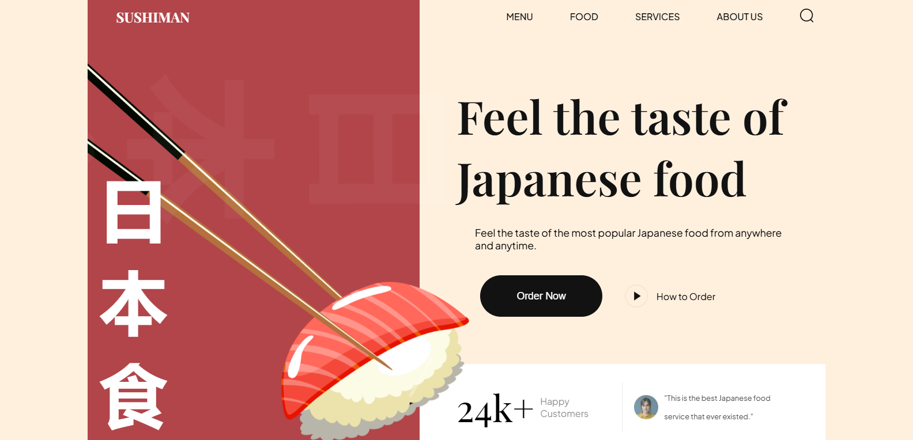
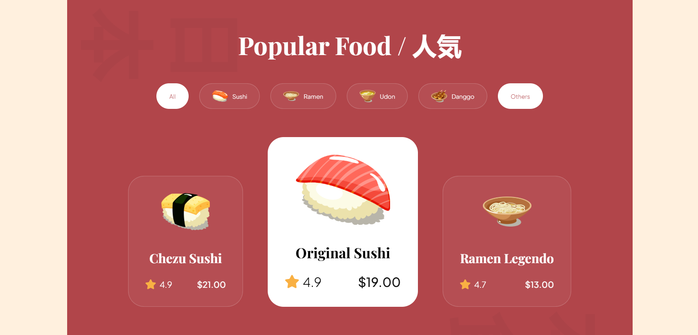

# 🍣 Sushi Delight - Smooth Scroll Restaurant Website
This project is a modern, fully **responsive** sushi restaurant website built with **HTML and CSS**, showcasing the traditional elegance and modern appeal of Japanese cuisine. 
The site offers an engaging experience with smooth scrolling animations powered by the **AOS library**, creating an interactive and visually captivating user journey.

The **responsive design** ensures the website looks and functions beautifully on all devices, from desktops to smartphones. The clean and vibrant layout reflects the artistry of 
sushi, making it perfect for attracting food enthusiasts and showcasing a creative approach to web design.

# 🛠️ Main Features
- **HTML CSS**
- **AOS Library for Smooth Scroll Animations**
- **Fully Responsive Design**
- **Modern and Elegant UI/UX Design**

# 📷 Screenshots

